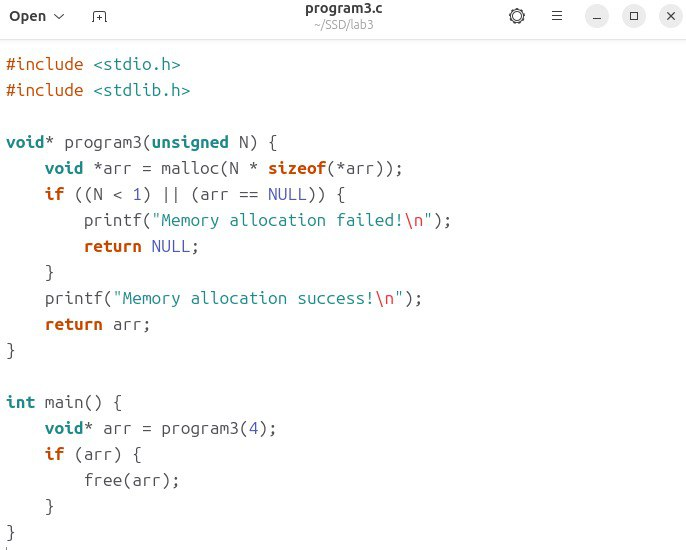

# Lab 3 - Memory Safety

**Student:** Egor Valikov

**Group:** B22-CBS-01

**Email:** e.valikov@innopolis.university

**Telegram:** @EgorValikov

**Github report:** https://github.com/zDragonLORD1010/Secure-System-Development-/blob/main/lab3/lab3_Report_Egor_Valikov.md

## Task 1/2 Getting started (Program analysis and fix)

I installed needed tools (`gcc` and `valgrind`) without any problems:

## Program 1 analysis

### Program creation and testing

First of all, I created `program1.c` file, compiled and tested the program for performance. I got the desired output.

### `valgrind` analysis

I analyzed `program1.c` using `valgrind` and got the following output:

**Link to the full report:** [`valgrind_output1.txt`](https://github.com/zDragonLORD1010/Secure-System-Development-/blob/main/lab3/valgrind_output1.txt)

### Explanation of `valgrind` output

I found the following vulnerabilities here (The description is taken from the CWE website: [CWE-122](https://cwe.mitre.org/data/definitions/122), [CWE-401](https://cwe.mitre.org/data/definitions/401)):

**1. CWE-122: Heap-based Buffer Overflow**

- **Description:** A heap overflow condition is a buffer overflow, where the buffer that can be overwritten is allocated in the heap portion of memory, generally meaning that the buffer was allocated using a routine such as `malloc()`.
- In our case, the program writes data outside of the allocated memory, because `malloc(N)` allocates only `N` bytes instead of `N*sizeof(int)`. Therefore, the simplest option I can suggest is to allocate the size using `malloc(N*sizeof(int))`.

**2. CWE-401: Missing Release of Memory after Effective Lifetime**

- **Description:** The product does not sufficiently track and release allocated memory after it has been used, which slowly consumes remaining memory.
- The allocated memory `malloc(N)` is never freed. So we need to use `free(arr)` at the end of `program1()`.

### Program 1 after fix

**Link to the fixed code of firts program:** [`program1.c`](https://github.com/zDragonLORD1010/Secure-System-Development-/blob/main/lab3/program1.c)

Verifying the output:

## Program 2 analysis

### Program creation and testing

First of all, I created `program2.c` file, compiled and tested the program for performance. I got the desired output.

### `valgrind` analysis

I analyzed `program2.c` using `valgrind` and got the following output:

**Link to the full report:** [`valgrind_output2.txt`](https://github.com/zDragonLORD1010/Secure-System-Development-/blob/main/lab3/valgrind_output2.txt)

### Explanation of `valgrind` output

I found the following vulnerabilities here (The description is taken from the CWE website: [CWE-416](https://cwe.mitre.org/data/definitions/416)):

**1. CWE-416: Use After Free**

- **Description:** The product reuses or references memory after it has been freed. At some point afterward, the memory may be allocated again and saved in another pointer, while the original pointer references a location somewhere within the new allocation. Any operations using the original pointer are no longer valid because the memory "belongs" to the code that operates on the new pointer.
- In our case, the `work()` function is free `arr`, but `program2()` is still trying to access it. Therefore, I suggest moving `free(arr)` to the end of the `program2()` function and checking `arr` at the beginning, just in case.

Also fixed `memset(arr, 0, sizeof(*arr))` to `memset(arr, 0, N * sizeof(*arr))` (I'm not sure if this refers to a vulnerability like CWE-122, so I just fixed it.).

### Program 2 after fix

**Link to the fixed code of firts program:** [`program2.c`](https://github.com/zDragonLORD1010/Secure-System-Development-/blob/main/lab3/program2.c)

Verifying the output:

## Program 3 analysis

### Program creation and testing

First of all, I created `program3.c` file, compiled and tested the program for performance. I got the desired output.

### `valgrind` analysis

I analyzed `program3.c` using `valgrind` and got the following output:

**Link to the full report:** [`valgrind_output3.txt`](https://github.com/zDragonLORD1010/Secure-System-Development-/blob/main/lab3/valgrind_output3.txt)

### Explanation of `valgrind` output

I found the following vulnerabilities here (The description is taken from the CWE website: [CWE-690](https://cwe.mitre.org/data/definitions/690)):

**1. CWE-690: Unchecked Return Value to NULL Pointer Dereference**

- **Description:** The product does not check for an error after calling a function that can return with a `NULL` pointer if the function fails, which leads to a resultant `NULL` pointer dereference.
- In our case, we need to add a check at the end, because we can get `arr = NULL`.

I also fixed a typo in the `if` condition (`arr = NULL` to `arr == NULL`) and remove `string.h` because I think we don't need this library (to make the code simpler, especially since it did not affect its performance.).

### Program 3 after fix

**Link to the fixed code of firts program:** [`program3.c`](https://github.com/zDragonLORD1010/Secure-System-Development-/blob/main/lab3/program3.c)

Verifying the output:

## Program 4 analysis

### Program creation and testing

First of all, I created `program4.c` file, compiled and tested the program for performance. I got the desired output.

### `valgrind` analysis

I analyzed `program4.c` using `valgrind` and got the following output:

**Link to the full report:** [`valgrind_output4.txt`](https://github.com/zDragonLORD1010/Secure-System-Development-/blob/main/lab3/valgrind_output4.txt)

### Explanation of `valgrind` output

I found the following vulnerabilities here (The description is taken from the CWE website: [CWE-562](https://cwe.mitre.org/data/definitions/562)):

**1. CWE-562: Return of Stack Variable Address**

- **Description:** A function returns the address of a stack variable, which will cause unintended program behavior, typically in the form of a crash.
- The message variable is declared as a local array inside the `getString()` function, which means that it is released (becomes invalid) after the `getString()` function returns. Therefore, to fix this, I first allocate memory on heap (`ret = malloc(100 * sizeof(char))`), then copy string (`strcpy(ret, "Hello World!")`), and then return `ret`. In the end, I have free allocated memory (`free(str)`).

### Program 4 after fix

**Link to the fixed code of firts program:** [`program4.c`](https://github.com/zDragonLORD1010/Secure-System-Development-/blob/main/lab3/program4.c)

Verifying the output:

